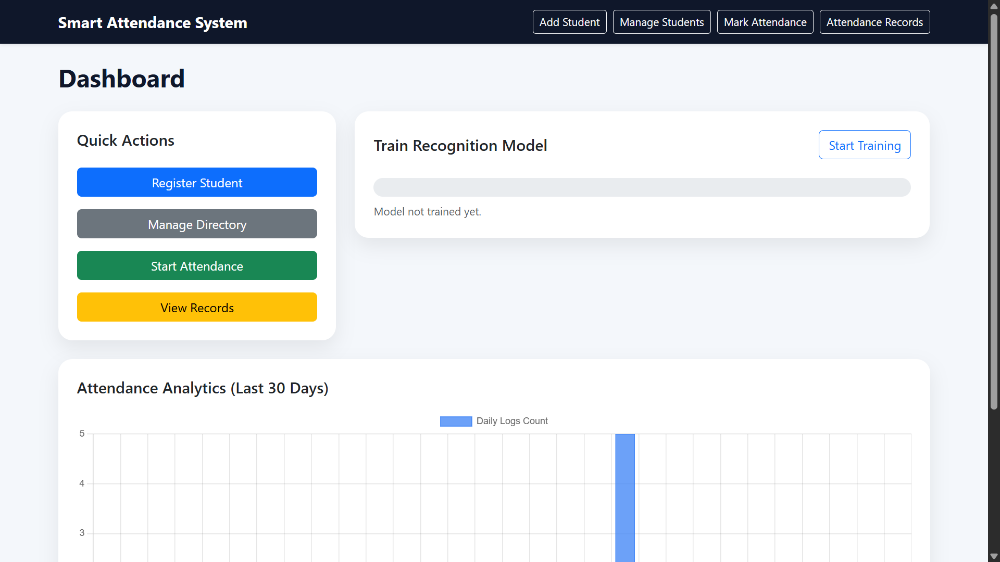

# 🎓 Digital Facial Recognition Attendance System

  

## 📖 Overview

The **Digital Facial Recognition Attendance System** is an AI-powered web application that automates attendance using facial recognition technology. Instead of relying on traditional methods such as manual registers or RFID cards, the system identifies individuals in real time using computer vision and machine learning, ensuring **accuracy, security, and efficiency**.

---

## ✨ Features

* 🤖 **Real-Time Facial Recognition**

  * Detects and recognizes faces using AI and computer vision.
  * Prevents proxy attendance by uniquely identifying each individual.

* ✅ **Automated Attendance Logging**

  * Records attendance instantly without manual intervention.
  * Eliminates human errors and reduces paperwork.

* 💾 **Database Integration**

  * Stores attendance records securely using SQLite.
  * Enables quick retrieval and data management.

* 👤 **Student Management**

  * Register new students.
  * Manage and update student information.
  * Store facial datasets for recognition.

* 📊 **Attendance Analytics**

  * View attendance reports.
  * Monitor attendance trends using graphical visualizations.

* 🔐 **Secure & Accurate Recognition**

  * Performs reliably under varying lighting conditions.
  * Supports recognition with glasses and minor facial variations.

* 🖥️ **Interactive Dashboard**

  * Clean and responsive web interface.
  * Easy navigation for attendance and student management.

---

## 🚀 Applications

* 🏫 Schools & Colleges
* 🎓 Universities
* 🏢 Corporate Offices
* 📚 Training Institutes
* 📝 Workshops & Seminars

---

## 💡 Benefits

* ✅ Fully automated attendance system
* ✅ Accurate facial recognition
* ✅ Eliminates proxy attendance
* ✅ Saves time and administrative effort
* ✅ Secure attendance record management
* ✅ Real-time attendance analytics
* ✅ User-friendly dashboard interface

---

## 📸 Dashboard Preview

  

---

